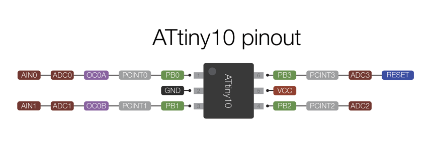

# Lulu-MCU / Firmware
**Programming light into textile**

## Project content
## Hardware design
     _______   _______   _______
    |       | |       | |       |             ___/\/\/\___ VCC
    | LULU  | | LULU  | | LULU  |            |    4.7K
    |_______| |_______| |_______|            |
    ____|||_______|||_______|||_______ 3.3V  |
    _____||________||________||______________|___ Data
    ______|_________|_________|_______ GND

### ATTiny10 pin mapping

## Programming
- Download the [https://github.com/technoblogy/attiny10core](ATtiny10Core "Programming the ATtiny10 with Arduino") hardware configuration from my repository on GitHub ATtiny10Core.
- Copy it to Documents/Arduino/hardware folder. If this hardware folder isn't already ther you have to create it.
- Restart the Arduino IDE.
- In the Arduino menu > Tools/Board select ATtiny10/9/5/4
- Open Lulu-MCU program with the Arduino IDE.
- Connect the TPI programmer (NOT ICSP) to the ATtiny10 as shown in the following diagram.
- In the Arduino menu > Tools/programmer select AVRISP mkII
- You are ready to flash the lulu-MCU 

#### TPI programmer (AVR-ISP-MK2)
- [https://www.olimex.com/Products/AVR/Programmers/AVR-ISP-MK2/resources/AVR-ISP-MK2.pdf](olimex TPI prog "AVR-ISP-MK2 TPI prog")
- [https://make.kosakalab.com/make/electronic-work/arduino_tpi_en/](bitDuino10-aTPI "Arduino as TPI prog")

#### TPI pin mapping

             ------
     DATA 1 | +  + | 2 VTARGET
    CLOCK 3 | +  + | 4 NA
    RESET 5 | +  + | 6 GND
             ------

#### Wiring the ATTiny10 to TPI programmer
| ATTINY10 - PIN   | PIN FONCTION |  TPI-connector  |
|------------------|--------------|-----------------|
|  1-PB0           |   TPIDATA    |  1-DATA         |
|  2-GND           |   GND        |  6-GND          |
|  3-PB1           |   TPICLK     |  3-CLOCK        |
|  4-PB2           |   NC         |  4-NA           |
|  5-VCC           |   +5V        |  2-VTARGET      |
|  6-PB3           |   RESET      |  5-RESET        |

On Linux Check if you are in the dialout group
    cd /etc/udev/rules.d

## One-wire protocol
The standard 1-wire protocol uses only two lines: power and ground. Data is
transmitted to and from slave devices by a master device by toggling the power
line low for short periods of time. The slave devices maintain their power
during these short losses using a diode-capacitor rectifier circuit. However,
this protocol is not suitable for devices requiring more than a few hundred
microamps due to the fact that a large pullup resistor is used on the power
line and drawing too much current causes an unacceptable voltage drop.

## Modified One-wire protocol
This device uses a modified version of the protocol that sacrifices the bi-directionality of the protocol to fit in 1k of flash memory.
This protcol has been modified from the actual 1-wire specification to be simpler to use with a 100KHz tick rate on the master 
in addition to necessary modifications due to the loss of bidirectionality.

### Protocol synopsis
 * A reset is performed by holding the line low for 480uS. This device will
   listen for a continuously low input for the full 480uS without any additional
   edges. The master should allow the line to float for another 480uS. Normally,
   the presence pulse would be read during this time. However, there is no
   presence pulse in this system.
 * Following a reset, A falling edge must occur within 70uS. This marks the
   start of the LSB of the transmitted byte.
 * To write a 0, the master brings the line low for 60uS. The slave will sample
   between 20-30uS following the falling edge. Following this, the master will
   allow the line to float for 10uS before beginning the next bit.
 * To write a 1, the master brings the line low for 10uS and releases it. The
   slave will sample between 20-30uS following the falling edge. The master will
   allow the line to float for 60uS after the initial low pulse.
 * A transaction consists of the reset pulse following by 8 write pulses.

# REFs
- https://github.com/kcuzner/onewire-leds.git (Forked)
- http://www.technoblogy.com/show?1YQY
- http://irq5.io/2017/09/09/writing-code-for-the-attiny10/
- http://electronut.in/attiny10-hello/

# TODO
- 