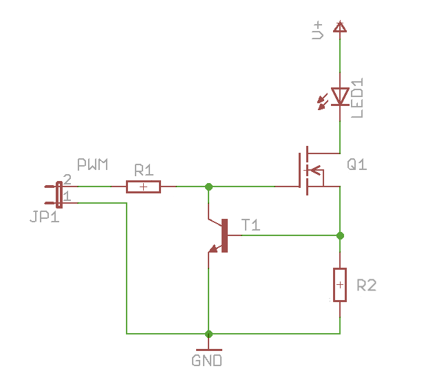

# Lulu-star / Hardware
**Programming light into textile**

## Hardware design
This branch is using a 200mA power LED.

Lulu-star have three connections.
- [+] 3.3 to 60 Voltes
- [PWM] I/O PIN
- [-] GND

      _______
     |       |
     | POWER |-----------------
     |_______|--------------| |
        | |                 | |
      + | | -             + | | -
     ___|_|____             | |
    |         |           __| |__
    |    A    |   PWM    |       |
    |    R    |--------->| LULU  |
    |    D    |          |_______|
    |    U    |             | |
    |    N    |           __| |__
    |    I    |   PWM    |       |
    |    O    |--------->| LULU  |
    |_________|          |_______|
                            | |

Easy to programmed, Lulu-star is using the Arduino IDE standard functions.
No library required.

    digitalWrite(LED_PIN, state);
    analogWrite(LED_PIN, val);

### LED driver
##### Constant current source

**References**
- https://learn.adafruit.com/pixie-3-watt-smart-chainable-led-pixels/design
- http://www.instructables.com/id/Power-LED-s---simplest-light-with-constant-current/
- https://scienceprog.com/building-simple-constant-current-power-led-driver/
- http://www.pcbheaven.com/userpages/LED_driving_and_controlling_methods/?topic=worklog&p=3

#### Circuit part list
| Part                         | REF                       | Package                | Price per unit | Weblink                |
| ---------------------------- | ------------------------- | -----------------------|--------------- |------------------------|
| Power LED / OSRAM 200mA      | LY CN5M                   |                        | 0.65 $         | [https://fr.aliexpress.com/](https://fr.aliexpress.com/item/OSRAM-OSLON-SX-High-Power-LED-0-5W-3030-Yellow-LY-CN5M/32865040281.html?spm=a2g0s.9042311.0.0.27426c371XVtDl) |
| Q1 - large N-channel MOSFET  | IRLML2060TRPBF            | SOT-23                 | 0,134 €        |                        |
| T1 - small NPN transistor    | MMBT2222A                 | SOT-23                 | 0,0412 €       |                        |
| R1                           | Approximately 47k-ohm     | 0603                   | 0,0147 €       |                        |
| R2 - current set resistor    | 2.7 ohms 1/4 watt         | 1206                   | 0,0246 €       |                        |

- **R2** is used to set the current limit and this doesn't depends on the voltage supply VDD.
- **Q1** is used as a variable resistor. **Q1** starts out turned on by **R1**.
- **T1** is used as an over-current sensing switch, and **R2** is the "sense resistor" that triggers **T1** when too much current is flowing.
- The main current flow is through the LED's, through **Q1**, and through **R2**. When too much current flows through **R2**, **T1** will start to turn on, which starts turning off **Q1**. Turning off **Q1** reduces the current through the LED's and **R2**.
- So we've created a **feedback loop**, which continuously tracks the current and keeps it exactly at the set point at all times.

The NPN transistors **T1** have a specified 0.6V drop between base and emitter when on.
This means the voltage across their respective shunt resistors **R2** will always be 0.6V.
According to Ohm’s law, this means that the current through them will be '0.6 V / 2.7 Ohm', or about 222mA.

### PCB design
To facilitate forkable design the PCB is made with Upverter an online PCB router software.
We are looking for a shape that allow zero waste in the panelization process.
- [Circle shape is 2.0.*](https://upverter.com/DataPaulette/5193c940bede1099/Lulu-star_20/ "Made with Upvetrter, online PCB router software") : the circle shape correspond to the more common eTextile PCB but doesn't fit the zero waste.
- [Triangle shape is 2.1.*](https://upverter.com/DataPaulette/08fe1452dfd87b08/Lulu-star_21/ "Made with Upvetrter, online PCB router software") : triangle is a shape that fit the three wire connectors and the zero waste panelization process.

- Base Material : FR-4 TG13
- No. of Layers : 2 layers
- PCB Thickness : 1.6
- PCB Color : Black
- Surface Finish : HASL
- Minimum Solder Mask Dam : 0.4 mm
- Copper Weight : 1oz
- Minimum Drill Hole Size : 0.3 mm
- Trace Width / Spacing : 5/5 mil
- Blind or Buried Vias : NO
- Plated Half-holes / Castellated Holes : YES
- Impedance Control : NO

#### Part list
| Part                       | REF                      | Price per unit   | Weblink        |
| -------------------------- | ------------------------ | -----------------|--------------- |
| Brass tube                 | 2 mm Hole 5-10 mm Length |                  |                |
| JTE connector              | 1.5 / 8 mm               |                  |                |
| Optical fibres PMMA        | 0.25 mm x 35 pce         |                  |                |
| Optical fibres TPU         | 1.5, 2, 3 mm             |                  |                |
| Optical fibres tube + core |                          |                  | [www.leds-and-more.de](https://www.leds-and-more.de/catalog/15mm-lwl-lichtwellenleiter-lichtleiter-seitlich-leuchtend-p-1937.html?osCsid=2me5dl4q5amcvgb6tnbqfd87i5) |

## TODO
- [ ] Find 0.5W side LEDs
- [ ] Chose between a small single LED driver & Constant current source circuitry
- [ ] Optimize the power LED heat dissipation
- [ ] Identifying distributors in Europe