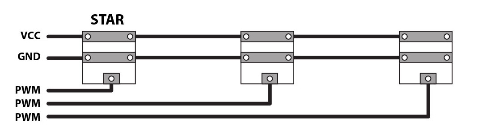

# Lulu-star / Hardware
**Programming light into textile**

## Hardware design
This branch of the Lulu project is using a 200mA power LED with current current circuitry.
As the project is focussing on embedded electronics we chosed an high power OSRAM OSLON LED that can have a good autonomy with a small Lypo battry (1000 mA).
As this kind of LED is seeking 200 mA (5 hour of autonomy with a 1000 mA battery).
The LED is also providing a narrow angle (60°) to focus the light in the optic fiber tranche.
	See datasheet: https://github.com/eTextile/Lulu/blob/master/Hardware/DOCs/LY_CN5M.pdf
The brass tube connector have been selected to fit the outer diameter of the LED package.
The PCB triangle shape have been selected to fit the zero waste in the production process.
All the components are SMD package to reduce the size and price of th PCB.
We have been experiencing a new way to hand solder the LED on the edge of the PCB but it is still not so handy to do it manually.
Custom tooling will be designed and tested to help in that soldering process.

## Release notes
### Lulu 2.1.2
- Initial release
### Lulu 2.1.3
- Clearance of top and bottom ground plane have been increased to avoid shortcuts due to the board edge cut to close.
- Resistor R2 have been flipped and the brass tube soldering pad moved.
- Updated brass tube soldering pad to be connected to the ground plane with thermals.
- Increased size of sewing holes to : 2mm
- Increased size of eTextile connectors to : 1mm
- Increased board size by ... mm
- Reorganized eTextile connectors order, this is more convenient for many purposes.

## Lulu connecting
- [VCC] (+) 3.3 to 5 Voltes
- [GND] (-) GND
- [PWM] I/O PIN

      +---+--------------+-------------------+-----
      |   |              |                   |
  + __|__ |              |                   |
  -  ___  |              |                   |
      |   |              |                   |
      +---|--------------|--+----------------|--+--
      |   |              |  |                |  |
      |   |              |  |                |  |
      |   |            __|__|__              |  |
     _|___|_           \ +  - /              |  |
    | +   - |           \    /               |  |
    |   M   |--- PWM --> \  /              __|__|__
    |   C   |             \/               \ +  - /
    |   U   |                               \    /
    |       |--- PWM ----------------------> \  /
    |_______|                                 \/

## Lulu Powering
The Lulu board must be powered with a voltage betwin 3.3V to 5V.
DO NOT USE 3V single coin battery - voltage is too low and it will not work for long.
Prefer the use of rechargeable Lipo battery with small Lipo charger.

## Lulu Arduino programming
Easy to programmed, Lulu-star is using the Arduino IDE standard functions - no library required.

    digitalWrite(LED_PIN, state);
    analogWrite(LED_PIN, val);

## Lulu LED driver built-in
### Constant current source circuitry

**References**
- https://learn.adafruit.com/pixie-3-watt-smart-chainable-led-pixels/design
- http://www.instructables.com/id/Power-LED-s---simplest-light-with-constant-current/
- https://scienceprog.com/building-simple-constant-current-power-led-driver/
- http://www.pcbheaven.com/userpages/LED_driving_and_controlling_methods/?topic=worklog&p=3

### Circuit part list
| Designator                                      | MPN                       | Package                | Price per unit | Weblink                |
| ----------------------------------------------- | ------------------------- | -----------------------|--------------- |------------------------|
| Power LED / OSRAM 200mA                         | LY CN5M                   |                        | 0.65 $         | [LY-CN5M](https://fr.aliexpress.com/item/OSRAM-OSLON-SX-High-Power-LED-0-5W-3030-Yellow-LY-CN5M/32865040281.html?spm=a2g0s.9042311.0.0.27426c371XVtDl) |
| Q1 - large N-channel MOSFET                     | IRLML2060TRPBF            | SOT-23                 | 0,126 €        | [IRLML2060TRPBF](https://www.digikey.com/product-detail/en/infineon-technologies/IRLML2060TRPBF/IRLML2060TRPBFCT-ND/2271917) |
| T1 - small NPN transistor                       | MMBT2222A                 | SOT-23                 | 0,0412 €       | [MMBT2222A](https://www.digikey.com/product-detail/en/diodes-incorporated/MMBT2222A-7-F/MMBT2222A-FDICT-ND/815723) |
| R1 - 47k-ohm resistor                           | RT0603DRD0747KL           | 0603                   | 0,0147 €       | [R-47k-ohm ](https://www.digikey.com/product-detail/en/yageo/RT0603DRD0747KL/311-47KDCT-ND/1035828) |
| R2 - current set resistor - 2.7 ohms 1/4 watt   |                           | 1206                   | 0,0246 €       | [R-2.7-ohm](https://fr.farnell.com/walsin/wr12w2r70ftl/resist-couche-epaisse-2-7r-1-0/dp/2668305) |
| R3 - 10k pull-down resistor                     | RT0603DRD0710KL           | 0603                   | 0,     €       | [R-10k-ohm](https://www.digikey.com/product-detail/en/yageo/RT0603DRD0710KL/311-10KDCT-ND/1035680) |

**R2** is used to set the current limit and this doesn't depends on the voltage supply VDD.
**Q1** is used as a variable resistor. **Q1** starts out turned on by **R1**.
**T1** is used as an over-current sensing switch, and **R2** is the "sense resistor" that triggers **T1** when too much current is flowing.
The main current flow is through the LED's, through **Q1**, and through **R2**.
When too much current flows through **R2**, **T1** will start to turn on, which starts turning off **Q1**. Turning off **Q1** reduces the current through the LED's and **R2**.
So we've created a **feedback loop**, which continuously tracks the current and keeps it exactly at the set point at all times.
The NPN transistors **T1** have a specified 0.6V drop between base and emitter when on.
This means the voltage across their respective shunt resistors **R2** will always be 0.6V.
According to Ohm’s law, this means that the current through them will be '0.6 V / 2.7 Ohm', or about 222mA.

## PCB manufacturing characteristics
  - Base Material : FR-4 TG13
  - No. of Layers : 2 layers
  - PCB Thickness : 1 mm
  - PCB Color : Yelow
  - Surface Finish : HASL
  - Minimum Solder Mask Dam : 0.4 mm
  - Copper Weight : 1oz (35 µm)
    - For 300 mA we nead 0.15mm copper traces (https://www.4pcb.com/trace-width-calculator.html)
  - Minimum Drill Hole Size : 0.3 mm
  - Trace Width / Spacing : 5/5 mil
  - Blind or Buried Vias : NO
  - Plated Half-holes / Castellated Holes : YES
  - Impedance Control : NO

### Extra Part list
| Part                       | REF                      | Price per unit   | Weblink        |
| -------------------------- | ------------------------ | -----------------|--------------- |
| Brass tube                 | 2 mm Hole 5-10 mm Length |                  |                |
| JTE connector              | 1.5 / 8 mm               |                  |                |
| Optical fibres PMMA        | 0.25 mm x 35 pce         |                  |                |
| Optical fibres TPU         | 1.5, 2, 3 mm             |                  |                |
| Optical fibres tube + core |                          |                  | [www.leds-and-more.de](https://www.leds-and-more.de/catalog/15mm-lwl-lichtwellenleiter-lichtleiter-seitlich-leuchtend-p-1937.html?osCsid=2me5dl4q5amcvgb6tnbqfd87i5) |

## TODO
- [ ] Find 0.5W side LEDs
- [ ] Chose between a small single LED driver & Constant current source circuitry
- [ ] Optimize the power LED heat dissipation
- [ ] Identifying distributors in Europe
